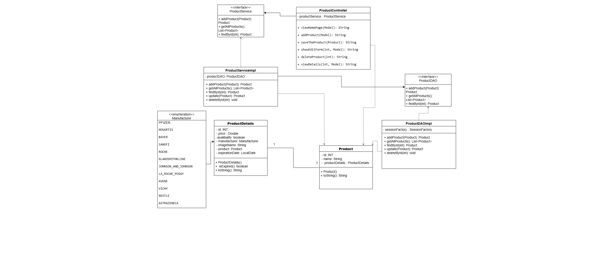
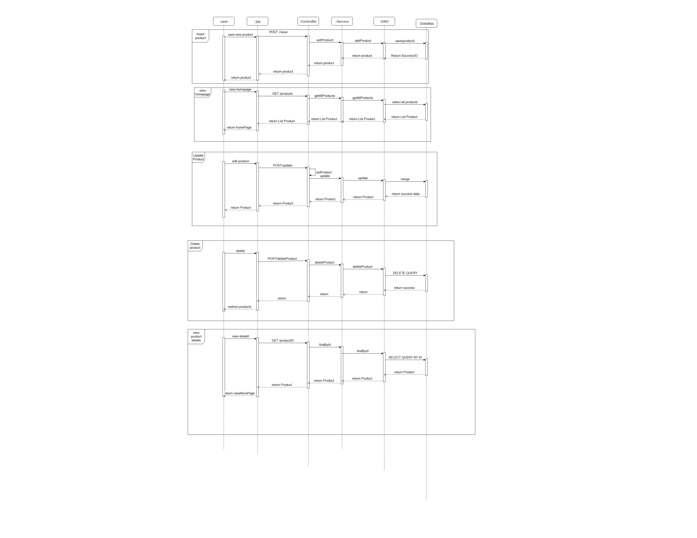

# 🧾 Product Management System

Simple **Spring MVC + Hibernate** web app to manage products and their details.


---

# ⚙️ Tech Stack

* Java 21
* Spring MVC
* Hibernate ORM
* MySQL (Dockerized)
* JSP
* C3P0 Connection Pool
* Apache Tomcat 9

---

# 🗄️ Database Script

```sql id="6xy93g"
CREATE DATABASE IF NOT EXISTS ecommerce_db;
USE ecommerce_db;

CREATE TABLE products(
    id INT PRIMARY KEY AUTO_INCREMENT,
    name VARCHAR(255)
);

CREATE TABLE Product_details(
    id INT PRIMARY KEY AUTO_INCREMENT,
    product_id INT UNIQUE,
    expiration_Date DATE,
    manufacturer VARCHAR(50),
    price DOUBLE NOT NULL,
    availability TINYINT(1),
    imageName VARCHAR(255),
    CONSTRAINT fk_product_link
        FOREIGN KEY (product_id)
        REFERENCES products(id)
        ON DELETE CASCADE
);
```

---


# 📊 UML Diagrams

This section contains the UML diagrams for the system:

## 🔹 Class Diagram



## 🔹 Sequence Diagram



---

# ▶️ How to Run

1. Run MySQL using Docker
2. Execute the SQL script
3. Build the project using Maven
4. Deploy on Tomcat 9

---

# 👩‍💻 Author

Tala Almansoour

